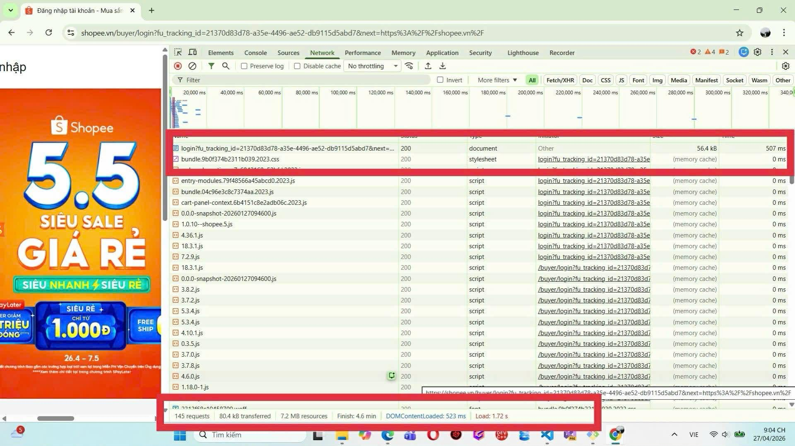

# Phần A - Kiểm tra đọc hiểu

## Câu A1 (5đ) - HTTP & Browser

**1. Trình tự các bước xảy ra khi gõ `https://shopee.vn` vào trình duyệt và nhấn Enter:**

1. Request xuất phát từ laptop của người dùng và đi qua router WiFi.
2. Request tiếp tục đi qua nhà cung cấp mạng và truyền qua hệ thống cáp quang.
3. Request được gửi đến data center chứa server của Shopee.
4. Server của Shopee tiếp nhận và xử lý yêu cầu này.
5. Response (bao gồm các file HTML, CSS, JS) chạy ngược lại lộ trình cũ: từ cáp quang qua nhà mạng, qua router và về lại laptop.
6. Trình duyệt nhận các file từ server và bắt đầu quá trình render (Parse HTML, Parse CSS, Execute JS, Paint & Render) để hiển thị thành giao diện trang web hoàn chỉnh.
**2. Tab Network trong DevTools của Chrome cho thấy thông tin gì?**
Tab Network (Mạng) trong DevTools là công cụ dùng để theo dõi toàn bộ các yêu cầu (requests) và phản hồi (responses) giữa trình duyệt và máy chủ khi một trang web được tải. Cụ thể, nó giúp chúng ta xem chi tiết các file nào đang được tải về (HTML, CSS, JS, hình ảnh), thời gian tải của từng file, dung lượng, và mã trạng thái (Status Code) để biết việc tải trang có thành công hay đang gặp lỗi.


*Nguồn tham chiếu: 01_introduction_html_universe.md - Phần 1.3. Browser Rendering*

## Câu A2 (5đ) - Semantic HTML

**1. Tại sao trang web bị Google đánh giá SEO thấp?**
Trang web trên bị Google đánh giá SEO thấp vì đoạn code đang mắc lỗi "Div Soup" — lạm dụng thẻ `<div>` cho mọi thành phần. Việc không sử dụng các thẻ Semantic (thẻ có ý nghĩa) khiến Google (và các công cụ tìm kiếm khác) không thể hiểu được cấu trúc nội dung trang web đâu là menu, đâu là nội dung chính, hay đâu là thông tin sản phẩm. Việc "dùng đúng thẻ = Google hiểu nội dung = SEO tốt hơn".

**2. Liệt kê ít nhất 4 lỗi semantic:**
Dựa vào bảng bản đồ Semantic Elements, đoạn code trên có các lỗi sau:
1. Dùng `<div class="header">` thay vì thẻ `<header>` cho phần đầu trang.
2. Dùng `<div class="menu">` thay vì thẻ `<nav>` cho phần điều hướng/menu.
3. Dùng `<div class="main">` thay vì thẻ `<main>` cho khu vực chứa nội dung chính.
4. Dùng `<div class="product">` thay vì thẻ `<article>` cho một nội dung/sản phẩm độc lập.
5. Dùng `<div class="footer">` thay vì thẻ `<footer>` cho phần cuối trang (copyright).
*Nguồn tham chiếu: 04_visible_part_html.md - Phần Semantic HTML5*

**3. Sửa lại code sử dụng Semantic HTML5:**

```html
<header>
    <div class="logo">ShopTLU</div>
    <nav>
        <div><a href="/">Trang chủ</a></div>
        <div><a href="/products">Sản phẩm</a></div>
    </nav>
</header>
<main>
    <article>
        <div class="title">iPhone 16 Pro</div>
        <div class="price">25.990.000đ</div>
        <figure>
            
        </figure>
    </article>
</main>
<footer>© 2026 ShopTLU</footer>
```

## Câu A3 (5đ) — Block vs Inline

**1. Mô tả kết quả hiển thị (Text art):**

Hộp 1
Text A Text B
Hộp 2
Text C Text D
Hộp 3

**2. Giải thích tại sao:**
* Thẻ `<div>` là phần tử **Block** (khối): Nó chiếm toàn bộ chiều ngang của trang (chiếm cả dòng) và luôn bắt đầu ở một dòng mới. Do đó, "Hộp 1", "Hộp 2", và "Hộp 3" đều đứng riêng biệt trên từng dòng.
* Thẻ `<span>` và `<strong>` là phần tử **Inline** (nội tuyến): Nó chỉ chiếm không gian vừa đủ cho nội dung bên trong và không tạo ra dòng mới. Do đó, "Text A" và "Text B" sẽ nằm cạnh nhau trên cùng một dòng. Tương tự, "Text C" và "Text D" cũng nằm liền kề nhau.

*Nguồn tham chiếu:`04_visible_part_html.md` - Phần "Block vs Inline"*


## Câu A4 (5đ) — Table

**1. Sự khác nhau giữa `<thead>`, `<tbody>`, `<tfoot>`:**
Đây là các thẻ Semantic dùng để phân chia cấu trúc logic của một bảng dữ liệu (Table):
* **`<thead>` (Table Head):** Dùng để nhóm các hàng chứa tiêu đề của các cột trong bảng.
* **`<tbody>` (Table Body):** Dùng để nhóm phần thân của bảng, chứa các hàng dữ liệu chính.
* **`<tfoot>` (Table Foot):** Dùng để nhóm các hàng ở cuối bảng, thường chứa dữ liệu tổng kết, tính tổng hoặc chú thích.

**2. Tại sao KHÔNG NÊN dùng table để tạo layout trang web? (3 lý do):**
1. **Khó làm Responsive:** Bảng (Table) có cấu trúc dạng lưới rất cứng nhắc, khiến việc co giãn và sắp xếp lại các thành phần giao diện trên màn hình nhỏ (điện thoại, tablet) trở nên vô cùng khó khăn.
2. **Code cồng kềnh, khó bảo trì:** Để tạo một layout bằng table, bạn phải lồng ghép rất nhiều thẻ `<table>`, `<tr>`, `<td>` vào nhau. Điều này tạo ra một mớ code khổng lồ, khó đọc và khó chỉnh sửa sau này.
3. **Phá vỡ tính Semantic và Accessibility (Khả năng tiếp cận):** Mục đích duy nhất của Table là để hiển thị dữ liệu dạng bảng. Việc dùng nó làm layout sẽ khiến các công cụ tìm kiếm (Google bot) khó hiểu được cấu trúc trang web (ảnh hưởng xấu đến SEO). Đồng thời, các trình đọc màn hình (Screen Reader) của người khiếm thị sẽ đọc toàn bộ trang web như một bảng dữ liệu, gây ra sự khó hiểu và trải nghiệm tồi tệ.

*Nguồn tham chiếu `05_tables_hyperlinks.md`*

# Phần B - Thực hành code
### Bài B3 — Debug HTML

Lỗi 1: Dòng 1 — Khai báo DOCTYPE sai cú pháp — Sửa thành `<!DOCTYPE html>`.
Lỗi 2: Dòng 4 — Thẻ `<title>` không có thẻ đóng — Sửa thành `<title>Trang web</title>`.
Lỗi 3: Dòng 5 — Thuộc tính charset viết sai — Sửa thành `<meta charset="UTF-8">`.
Lỗi 4: Dòng 8 — Thẻ `<h1>` đóng sai bằng thẻ mở — Sửa `<h1>` ở cuối thành `</h1>`.
Lỗi 5: Dòng 12 — Thẻ `<a>` thứ nhất đóng sai bằng thẻ mở — Sửa `<a>` ở cuối thành `</a>`.
Lỗi 6: Dòng 20 — Thẻ `` thiếu ngoặc kép ở `src` và thiếu thuộc tính `alt` bắt buộc — Sửa thành ``.
Lỗi 7: Dòng 22 — Lỗi chồng chéo thẻ (nesting error) giữa `<p>` và `<b>` — Sửa thành `<p>Giá: <b>25.990.000đ</b></p>`.
Lỗi 8: Dòng 27 — Bảng `<table>` thiếu các thẻ phân chia cấu trúc ngữ nghĩa (Semantic) — Cần bổ sung `<thead>` (chứa hàng Tên, Giá) và `<tbody>` (chứa hàng iPhone, 25tr).
Lỗi 9: Dòng 38 — Lỗi Semantic: Thẻ `<main>` được sử dụng 2 lần trong một trang (Mỗi trang chỉ được có 1 thẻ main) — Đổi thẻ `<main>` thứ hai thành `<aside>` hoặc gộp vào main phía trên.
Lỗi 10: Dòng 43 — Thẻ `<p>` trong footer thiếu thẻ đóng và thiếu thẻ đóng của HTML ở cuối cùng — Thêm `</p>` ở dòng 43 và `</html>` ở dòng cuối cùng.